## Отчет по практической работе 1
### Вахтомов Владимир Евгеньевич
### Группа еозИСИП 306(406)

Установка flutter sdk

git clone -b main https://github.com/flutter/flutter.git     

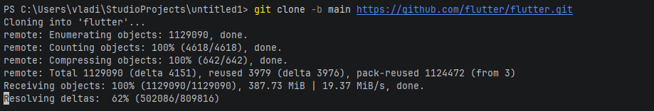

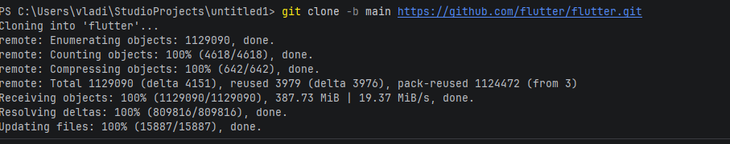

Переместил папку в "%userprofile%/fluter"
Get-ChildItem | Select-Object Mode, Length, LastWriteTime, Name
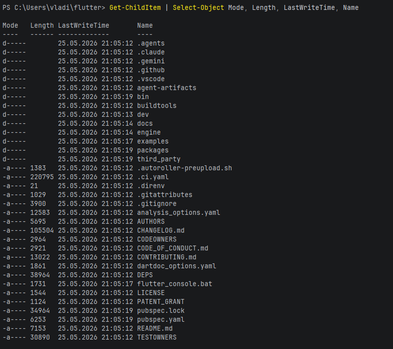

Добавил в path в системные переменные среды 
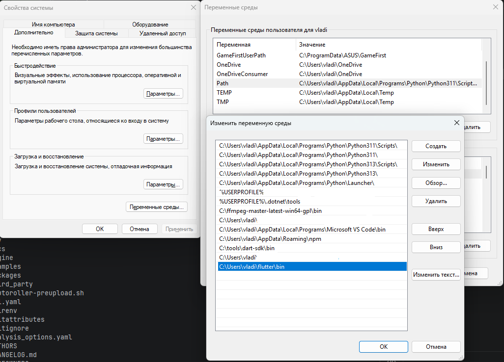

Установил Андроид студио 
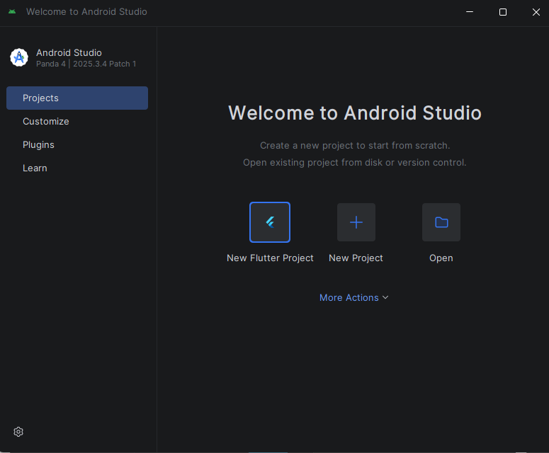

добавил SDK и tools  в настройках андроид студио
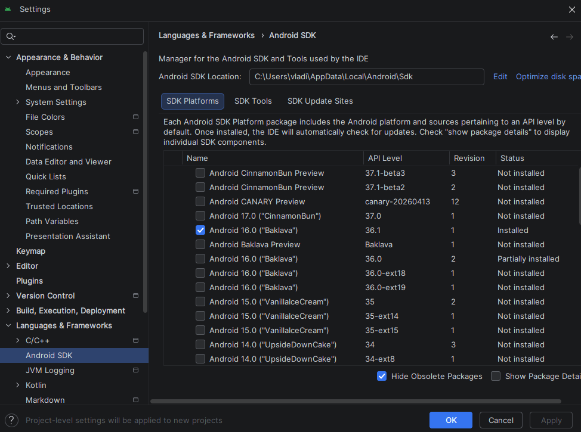

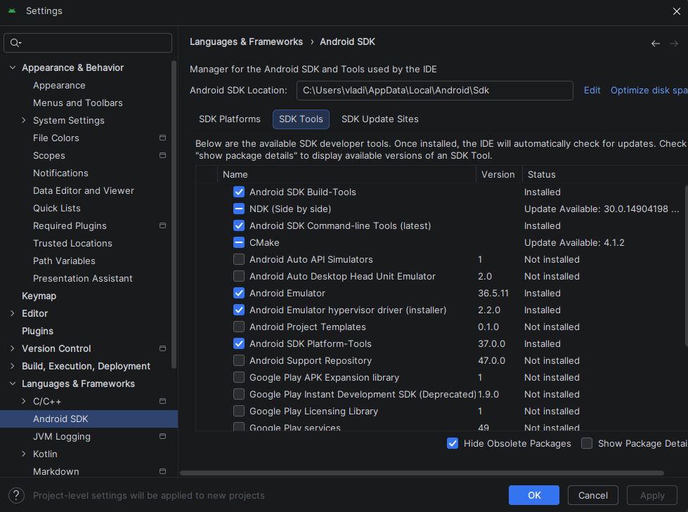

Принял все лицензии для андроид командой flutter doctor --android-licenses

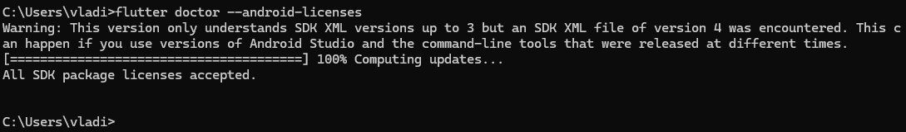

Установил плагин flutter внутри Андроид Студио
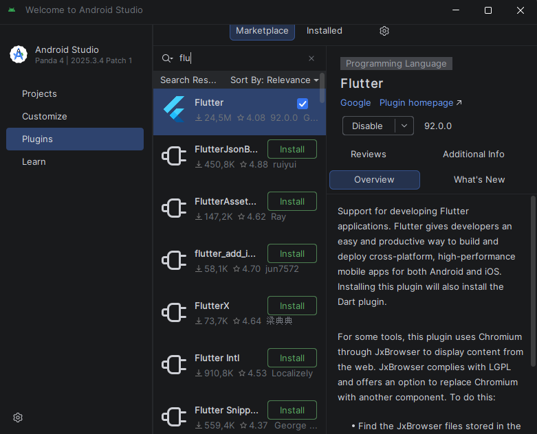

Создание flutter проекта доступно
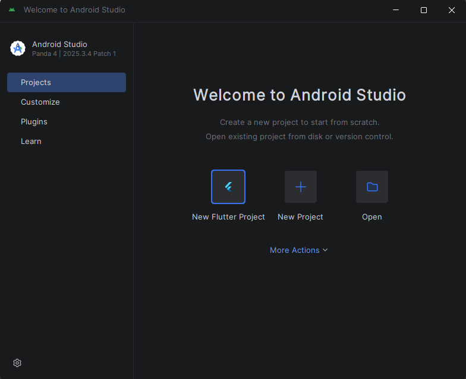

Создаем новый проект
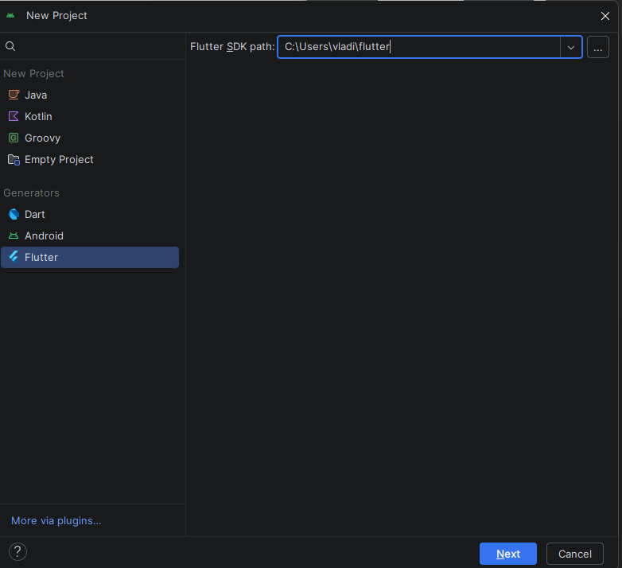

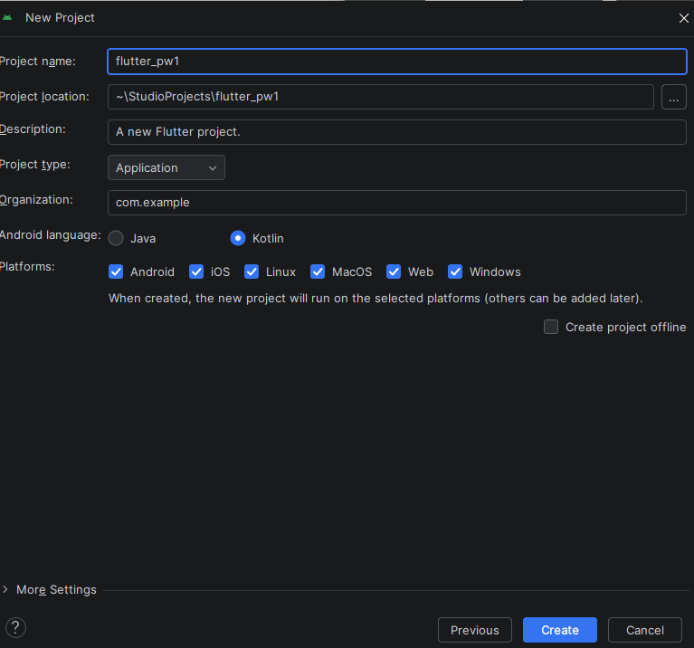

Проект создан
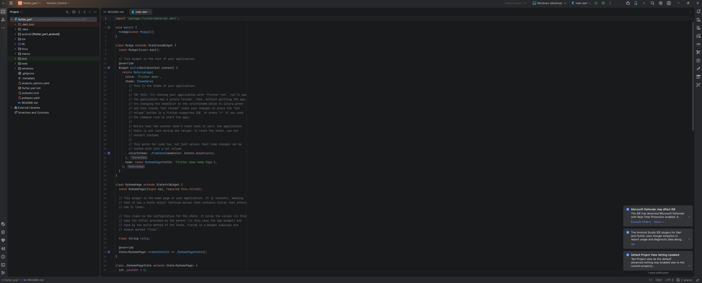

запуск в веб
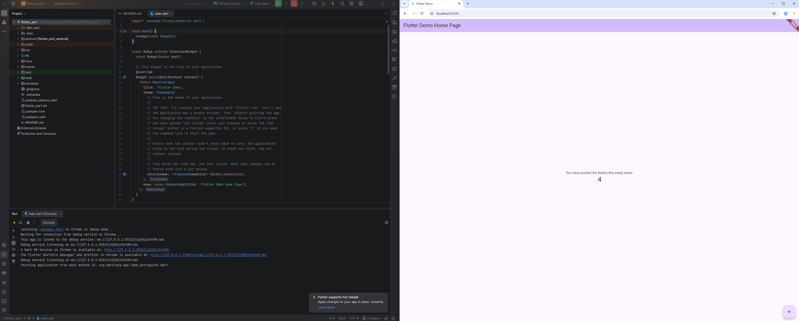

Доаблено устройство в devicemanager
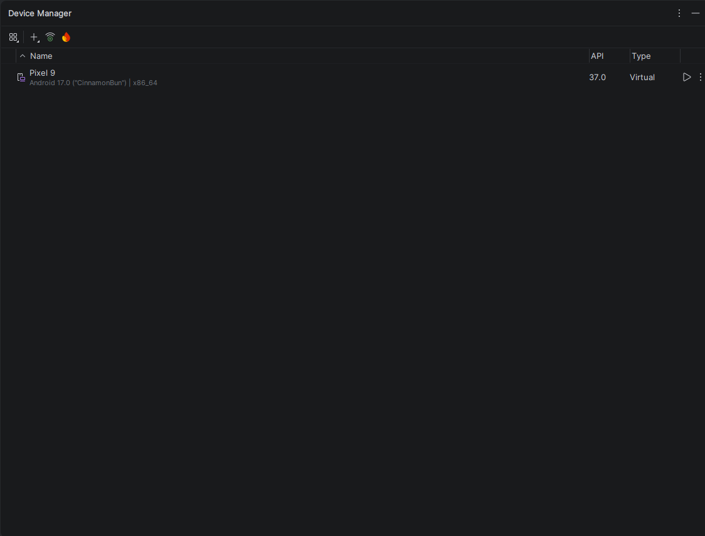
запуск устройства
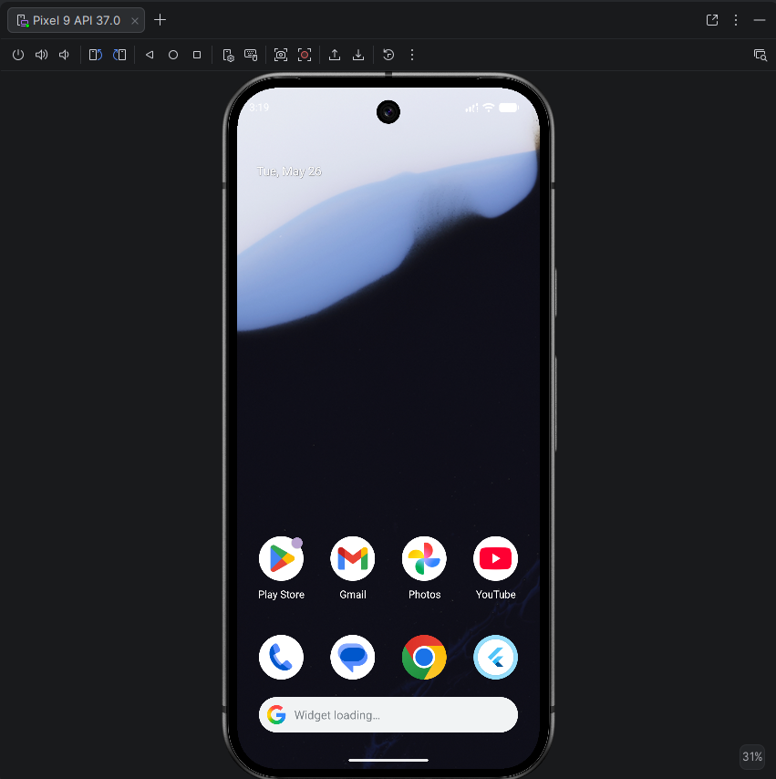

запустили на эмуляторе сменив таргет сборки на Pixel9 

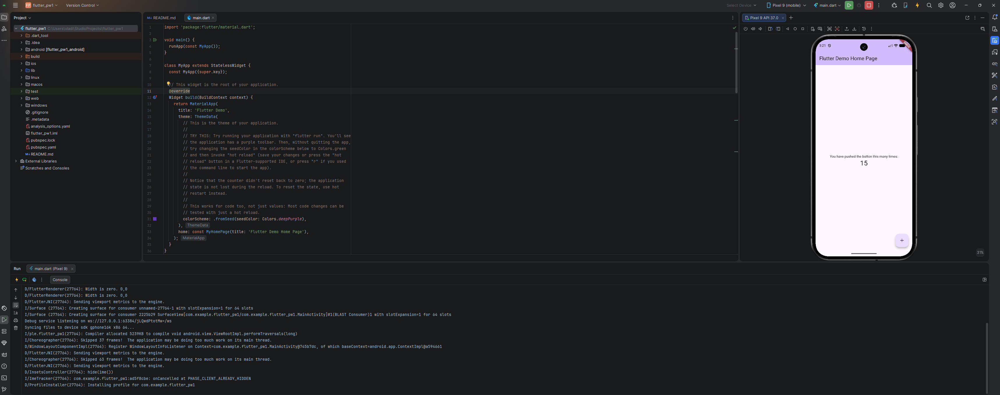
